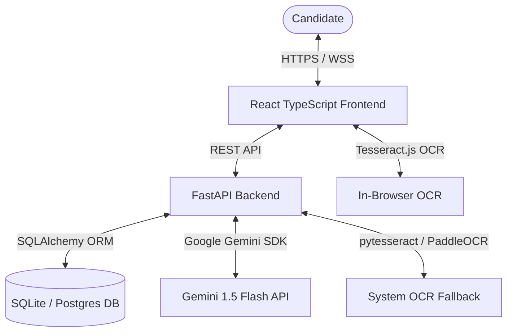
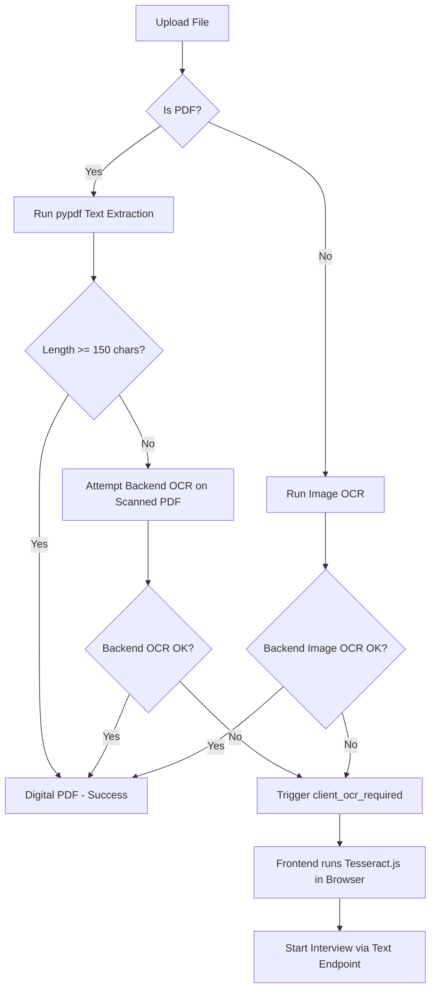
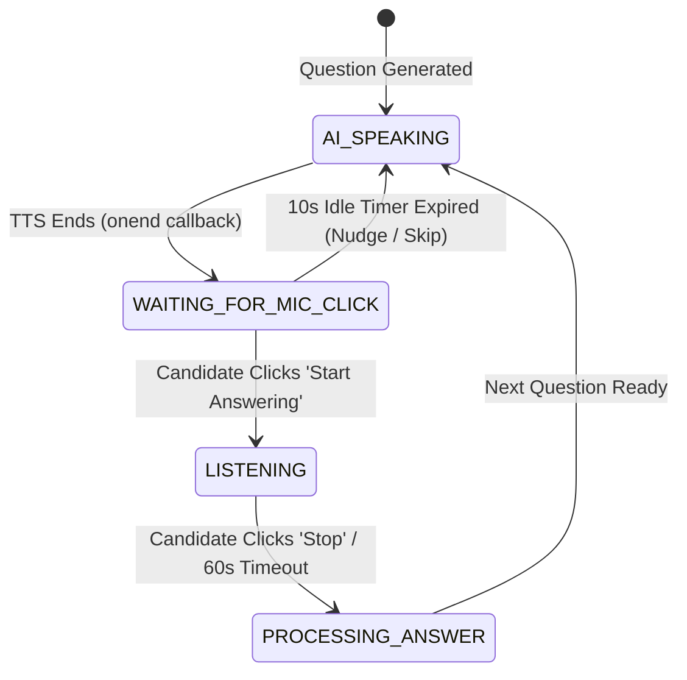

# AI Interviewer: Technical Overview & Architecture Document

This document provides a comprehensive technical overview and architectural blueprint of the **AI Interviewer: Mock Screening Suite**. It details the system components, data flow, OCR pipelines, state-aware conversation engine, synchronized voice timers, schema layouts, and prompt engineering architecture.

---

## 1. System Overview & Monorepo Structure

The AI Interviewer is a high-fidelity interview simulation platform that uses Large Language Models (LLMs) to screen candidates. The application is organized as a monorepo:

*   **Frontend (`/frontend`)**: A TypeScript React application styled with responsive, glassmorphic custom CSS and icons from Lucide React. Built on Vite for quick local development.
*   **Backend (`/backend`)**: A FastAPI Python service powered by SQLite (local development) / PostgreSQL database layers, using SQLAlchemy ORM for transaction handling, and integrating Google Generative AI (Gemini SDK) for conversational logic.
*   **Orchestrator (`/start.ps1`)**: A local automation PowerShell script that starts the backend and frontend concurrently in auto-reloading development servers.



---

## 2. Technical Architecture & Tech Stack

### Frontend Stack
*   **Framework**: React (v18) + TypeScript
*   **Build Tool**: Vite
*   **Styling**: Vanilla CSS (modular design tokens, glassmorphism, responsive flex layouts)
*   **OCR**: `tesseract.js` (for client-side browser OCR fallback)
*   **Icons**: `lucide-react`
*   **Voice APIs**: Web Speech API (`SpeechSynthesis` for Text-to-Speech and `webkitSpeechRecognition`/`SpeechRecognition` for Speech-to-Text)

### Backend Stack
*   **API Framework**: FastAPI
*   **WSGI/ASGI Server**: Uvicorn
*   **ORM**: SQLAlchemy
*   **Database**: SQLite (default developer file database `interview_db.db`) / PostgreSQL (production setup)
*   **Text Extractors**: `pypdf` (digital PDF parsing), `fitz` (PyMuPDF - rendering scanned pages to images)
*   **Backend OCR Engine**: `pytesseract` (Tesseract Wrapper) / `paddleocr` (PaddleOCR Fallback Engine)
*   **AI Engine**: `google-generativeai` SDK (running `gemini-flash-latest`)

---

## 3. Core Functional Workflows

### A. Resume Processing & OCR Pipeline
Handling scanned documents without enforcing system dependencies is a major design priority. The system executes a three-tier parser pipeline:



1.  **Digital PDF Parsing**: If the document is a native PDF, `pypdf` extracts the raw string character arrays.
2.  **Scanned PDF Backend OCR**: If the character array size is `< 150` characters, PyMuPDF renders PDF pages to `2x zoom matrix` PNG representations in-memory, running them through Tesseract or PaddleOCR on the server.
3.  **Client-Side Browser Fallback**: If backend OCR fails or libraries are missing, the backend returns `"status": "client_ocr_required"`. The React application catches this status and activates `tesseract.js` inside the user's browser, bypassing the need to install local system binaries.

---

### B. State-Aware Interview Flow
The interview operates on a strict **5-Question State Machine** matching indices $0$ to $4$:

| Index | Interview Stage | Behavioral Objective |
|---|---|---|
| **0** | **Introduction** | AI greets the candidate by their extracted name and invites them to introduce themselves. |
| **1** | **Project Probing** | Evaluates the candidate's introduction. Probes a project mentioned in their intro, or parses one from their resume to query. |
| **2** | **Core Concept** | Role-specific conceptual concepts (e.g. FastAPI vs standard REST APIs). |
| **3** | **General Engineering** | System design, testing strategies, security, performance, or database structures. |
| **4** | **Closing / Questions** | Concludes technical questions and prompts the candidate: "Do you have any questions?" |

---

### C. Conversation Continuity & Relevance Logic
Before transitioning to a higher index, the system enforces **Answer Relevance Checks** on every response:
*   **Acceptability Checks**: If the response is extremely short, generic, or off-topic, the backend flag `is_answer_acceptable` returns `false`. The interviewer does not progress the index and instead generates a polite nudge requesting clarification.
*   **"I Don't Know" / Skill Bypass**: If a candidate explicitly states they do not know the answer (e.g., `"no idea"`, `"i don't know"`), the backend flags `is_answer_acceptable` as `true`. It politely acknowledges the bypass ("Okay, let's leave that question. Let's move on.") and progresses to the next index.
*   **Background Detail Parsing**: When a resume is first uploaded, the backend returns metadata immediately using fast, regex-based local parsing. It then starts a background task (`BackgroundTasks`) to query Gemini for high-fidelity details (full name, email, skills) and updates the SQLite database dynamically without blocking user UX.

---

### D. Synchronized Voice Engine & Timers
To ensure a fluid voice interview without audio feedback or overlap, the React frontend orchestrates strict voice timers:



1.  **Strict TTS/STT Sequencing**: Web Speech SpeechRecognition is strictly paused while SpeechSynthesis is vocalizing AI responses. The microphone is disabled to prevent the browser from recording its own speakers.
2.  **10-Second Idle Timer**: Starts when the AI finishes speaking.
    *   *Question 0*: Plays a personal nudge ("Are you there, [Name]?") up to three times. On the fourth idle event, it terminates the session as a `no_show`.
    *   *Questions 1-4*: Plays a skip prompt and automatically calls the next question endpoint with `"Candidate did not respond"`.
3.  **60-Second Speech Timer**: While recording, a countdown timer runs. If it hits zero, it turns off the microphone, saves the buffer, and submits the current transcribed content.

---

## 4. Database Schema

Managed via SQLAlchemy in `database.py`. It establishes a 1-to-Many cascade relationship between sessions and messages:

```
┌────────────────────────────────────────┐
│           InterviewSession             │
├────────────────────────────────────────┤
│ - id (String, PK)                      │
│ - candidate_name (String, Nullable)    │
│ - candidate_email (String, Nullable)   │
│ - target_role (String, Default)        │
│ - resume_text (Text, Nullable)         │
│ - current_question_index (Integer, 0)  │
│ - total_questions (Integer, 5)         │
│ - status (String, Default: 'started')  │
│ - created_at (DateTime, UTCNow)        │
│ - final_feedback (JSON, Nullable)      │
└───────────────────┬────────────────────┘
                    │ 1
                    │
                    │ 1..* (Cascade Delete)
┌───────────────────▼────────────────────┐
│             ChatMessage                │
├────────────────────────────────────────┤
│ - id (Integer, PK, Autoincrement)      │
│ - session_id (String, FK -> Session)   │
│ - sender (String: 'ai' / 'candidate')  │
│ - message (Text)                       │
│ - timestamp (DateTime, UTCNow)         │
│ - evaluation (Text, Nullable)          │
└────────────────────────────────────────┘
```

---

## 5. API Endpoint Contracts

### 1. `POST /api/upload-resume`
Uploads resume binary.
*   **Inputs**: `file` (Multipart), `target_role` (Form parameter), `total_questions` (Form parameter).
*   **Outputs (Digital/Backend OCR)**:
    ```json
    {
      "success": true,
      "session_id": "uuid-v4-string",
      "details": {
        "candidate_name": "John Doe",
        "candidate_email": "john@example.com",
        "skills": ["Python", "FastAPI"],
        "experience_level": "Senior",
        "summary_evaluation": "..."
      },
      "status": "started"
    }
    ```
*   **Outputs (Client OCR Trigger)**:
    ```json
    {
      "success": false,
      "status": "client_ocr_required",
      "error": "OCR failed..."
    }
    ```

### 2. `POST /api/start-interview`
Launches session directly when sending pre-parsed text (used after browser Tesseract.js finishes).
*   **Inputs**: JSON body matching:
    ```json
    {
      "candidate_name": "John Doe",
      "candidate_email": "john@example.com",
      "target_role": "React Developer",
      "resume_text": "Full resume plain text...",
      "total_questions": 5
    }
    ```
*   **Outputs**: Identical structure to successful upload response.

### 3. `POST /api/sessions/{session_id}/next-question`
Central conversation flow handler. Saves previous user answer, runs evaluation, and returns the next question or feedback report.
*   **Inputs**: Optional JSON body `{"answer": "candidate response text"}`.
*   **Outputs (Ongoing)**:
    ```json
    {
      "status": "ongoing",
      "question": "What is your experience with Docker?",
      "evaluation": "Clear explanation of container virtualization...",
      "question_index": 2
    }
    ```
*   **Outputs (Finished)**:
    ```json
    {
      "status": "completed",
      "concluding_message": "Thank you for your time, John. We will be in touch.",
      "feedback": {
        "overall_score": 85,
        "verdict": "Hire",
        "summary": "...",
        "strengths": ["..."],
        "improvements": ["..."],
        "technical_skills_rating": 8,
        "technical_skills_comments": "...",
        "communication_skills_rating": 9,
        "communication_skills_comments": "...",
        "qa_breakdown": [ ... ]
      }
    }
    ```

### 4. `POST /api/sessions/{session_id}/terminate`
Forces immediate session termination (marks session status as `no_show`).

### 5. `GET /api/sessions`
Fetches a list of all historical completed sessions and final feedback objects.

### 6. `GET /api/sessions/{session_id}/report`
Fetches the complete evaluation feedback and detailed chat transcripts (including specific question evaluations).

---

## 6. Prompt Engineering & LLM Orchestration

The application uses specific JSON Schema matching instructions via `gemini-flash-latest`.

### A. Resume Metadata Extraction Prompt
Used to build the core profile during startup:
```
Analyze the following resume text and extract the details in JSON format.
Target Role: {target_role}

Resume Text:
{resume_text}

Provide the output in the following JSON structure (strict):
{{
    "candidate_name": "Full name of candidate, or 'Candidate' if not found",
    "candidate_email": "Email address, or null if not found",
    "skills": ["List of key technical or relevant skills matching the target role"],
    "experience_level": "Entry-level, Mid-level, Senior, or Lead",
    "summary_evaluation": "A 2-3 sentence overview of the candidate's profile in relation to the target role"
}}
```

### B. Conversation Manager Prompt (Next Question)
Enforces flow indexes, validates previous answers, checks for "I don't know" skip conditions, and generates questions:
```
You are a professional, technical, and friendly AI Interviewer conducting a screening for the position of: {target_role}.
Candidate's Name: {candidate_name}
The candidate's resume is provided below.

Candidate's Resume:
{resume_text}

Current Question Index: {question_index} (0-indexed)
Total Questions: 5

Here is the conversation history so far:
{history_str}

Your task is to generate the question for index {question_index} following this strict interview flow:
- Index 0: Introduce yourself as the AI Interviewer, welcome the candidate by their name ({candidate_name}) to the screening for the {target_role} role, and ask them to introduce themselves.
- Index 1: Read their introduction. If they mentioned a project in their introduction, ask probing questions about that specific project. If they did not mention a project, identify a relevant project in their resume and ask them to describe it and their contributions.
- Index 2: Ask a question about core technical terms or concepts related to the target role (for example, if the role is related to APIs/web services, ask "What is the difference between FastAPI and REST API?", or other relevant role-specific concepts).
- Index 3: Ask a technical question related to the job outside of their projects (e.g., testing, databases, security, performance, or system design).
- Index 4 (Pre-final Question): State that the technical questions are finished, and ask the candidate: "Do you have any questions?"

Answer Checking, Relevance & Continuity Rules:
1. Always address the candidate by their name ({candidate_name}) if known, instead of generic terms like "Candidate".
2. Evaluate the candidate's last message in the context of the question they were asked:
    - Determine if their answer actually addressed the previous question. Evaluate if it was relevant and sufficient.
    - If they avoided the question, gave an extremely brief/irrelevant answer, you MUST set "is_answer_acceptable" to false.
    - If "is_answer_acceptable" is false: Do not progress to the next index flow. Instead, generate a polite follow-up "question" asking them to address the missing parts or clarify.
    - Special Rule for "I don't know": If they state they don't know the answer ("I don't know", "i dont know", "no idea", etc.) to any question other than the first question (index > 0), you MUST set "is_answer_acceptable" to true, politely say "Okay, let's leave that question. Let's move on." and proceed to the next technical topic/question in the flow.
    - Otherwise, set "is_answer_acceptable" to true.

Provide your output in the following JSON format:
{{
    "evaluation": "A 1-2 sentence critique of the candidate's last response (constructive, detailing what was good or what was missing). Null if this is the first question (index 0).",
    "is_answer_acceptable": true/false,
    "question": "The next question or follow-up question."
}}
```

### C. Concluding Responder Prompt
Answers the candidate's question and closes the session:
```
You are an AI Interviewer concluding a screening interview for a {target_role} position.
Candidate Name: {candidate_name}

At the end of the interview, you asked the candidate if they had any questions, and they replied with:
"{candidate_answer}"

Write a professional, warm response in English that:
1. Answers their question directly or acknowledges their comment.
2. Concludes the interview and thanks them for their time.
3. States that the team will get back to them soon.
4. Keeps the response concise (2-4 sentences max).
```

### D. Final Evaluation Report Prompt
Generates the comprehensive recruiting report:
```
You are a Senior Technical Recruiter evaluating a candidate's performance in a mock interview.
Target Role: {target_role}

Candidate's Resume:
{resume_text}

Here is the full interview transcript:
{history_str}

Analyze the interview and output a detailed evaluation in JSON. Be honest, constructive, and thorough.

The output MUST adhere to this strict JSON structure:
{{
    "overall_score": 75, // Integer score between 0 and 100
    "verdict": "Strong Hire / Hire / Borderline / No Hire",
    "summary": "A high-level summary of the candidate's performance and fit for the role (3-4 sentences).",
    "strengths": [
        "Strength 1",
        "Strength 2",
        "Strength 3"
    ],
    "improvements": [
        "Area of improvement 1",
        "Area of improvement 2",
        "Area of improvement 3"
    ],
    "technical_skills_rating": 8, // Integer out of 10
    "technical_skills_comments": "Evaluation of their technical skills based on their answers.",
    "communication_skills_rating": 8, // Integer out of 10
    "communication_skills_comments": "Evaluation of their clarity, structure, and professional tone.",
    "qa_breakdown": [
      {{
          "question": "The question asked by AI",
          "answer": "The answer given by the candidate",
          "feedback": "Specific feedback on this response, what went well, and what could be better."
      }}
    ]
}}
```

---

## 7. Demo Mode & Local Fallbacks

If `GEMINI_API_KEY` is not detected in `.env`, the system automatically enters **Demo Mode**. 
*   **Metadata Extraction Fallback**: The backend uses local regular expressions to find emails, and matches lines of capital words against common dictionary skip-filters to isolate the candidate name. A search is performed for 20 common developer skills.
*   **Interview Progression Fallback**: Rather than requesting questions dynamically from Gemini, the backend retrieves preset questions matching each of the 5 indices.
*   **Final Report Fallback**: Generates mock evaluation reports demonstrating the exact schema and UI layout capabilities.
